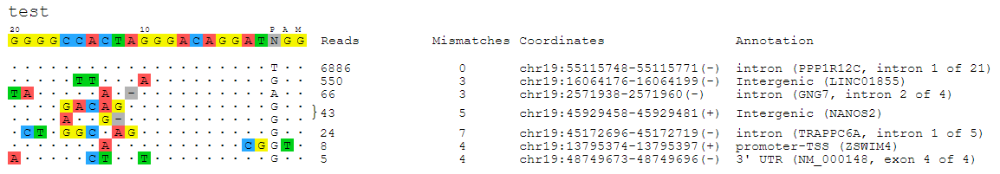

[![Version][version-shield]][version-url]
[![Python versions][python-shield]][python-url]
[![Platforms][platform-shield]][python-url]

# guideseq: The GUIDE-Seq Analysis Package

The guideseq package implements our data preprocessing and analysis pipeline for GUIDE-Seq-2 data. It takes raw sequencing reads (FASTQ) and a parameter manifest file (.yaml) as input and produces a table of annotated off-target sites as output.

## Table of Contents
- [Features](#features)
- [Dependencies](#dependencies)
- [Getting Set Up](#setup)
	- [Installation](#Installation)
	- [Quickstart](#Quickstart)
- [Running the Full Analysis Pipeline](#full_pipeline)
	- [Quickstart](#quickstart)
	- [Writing A Manifest File](#write_manifest)
	- [A Full Manifest File Example](manifest_example)
	- [Pipeline Outputs](#pipeline_output)
- [Running Analysis Steps Individually](#)


## Features<a name="features"></a>


The package implements a pipeline consisting of a read preprocessing module followed by an off-target identification module. The preprocessing module takes raw reads (FASTQ) from a pooled multi-sample sequencing run as input. Reads are demultiplexed into sample-specific FASTQs and PCR duplicates are removed using unique molecular index (UMI) barcode information.


The individual pipeline steps are:

1. **Sample demultiplexing**: A pooled multi-sample sequencing run is demultiplexed into sample-specific read files based on sample-specific dual-indexed barcodes. Default mismatch is 1. 

2. **PCR Duplicate Consolidation**:Reads that share the same UMI are presumed to originate from the same pre-PCR molecule and are thus consolidated into a single consensus read to improve quantitative interpretation of GUIDE-Seq read counts. This is done using `UMI-tools`. 

3. **Read Alignment**: The demultiplexed, consolidated paired end reads are aligned to a reference genome using the BWA-MEM algorithm with default parameters (Li. H, 2009).

4. **Candidate Site Identification**: The start mapping positions of the read amplified with the tag-specific primer (R2) are tabulated on a genome-wide basis. Start mapping positions are consolidated using a 10-bp sliding window (internal parameter). Windows with reads mapping to both + and - strands, or to the same strand but amplified with both forward and reverse tag-specific primers, are flagged as sites of potential DSBs. 25 bp of reference sequence (`window_size`) is retrieved on either side of the most frequently occuring start-mapping position in each flagged window. The retrieved sequence is aligned to the intended target sequence using a Smith-Waterman local-alignment algorithm. 

5. **False positive filtering**: Off-target cleavage sites with more than 7 mismatches (`max_score`, mismatch counted as 1, indel counted as 3) to the intended target sequence, or that are present in background controls, are filtered out.

6. **Reporting**: Identified off-targets, sorted by GUIDE-Seq read count are annotated in a final output table. The GUIDE-Seq read count is expected to scale approximately linearly with cleavage rates (Tsai et al., *Nat Biotechnol.* 2015).

7. **Visualization**: Alignment of detected off-target sites is visualized via a color-coded sequence grid, as seen below:



## Docker Usage

The simplest way to use tools developed in Tsai Lab.

```

docker pull liyc1989/tsailabsj

git clone https://github.com/tsailabSJ/guideseq.git

cd guideseq

docker run --rm -v .:/app liyc1989/tsailabsj sh -c "python guideseq/guideseq.py -h"

docker run --rm -v .:/app liyc1989/tsailabsj sh -c "cd test;python /app/guideseq/guideseq.py main -m test_manifest.yaml"

```


## Dependencies<a name="dependencies"></a>
* Python 3
* Reference genome fasta file ([Example](http://www.broadinstitute.org/ftp/pub/seq/references/Homo_sapiens_assembly19.fasta))
* [`bwa`](<http://bio-bwa.sourceforge.net/>) alignment tool
* [`bedtools`](<http://bedtools.readthedocs.org/en/latest/>) genome arithmetic utility
* [`samtools`](<http://www.htslib.org/>) genome arithmetic utility
* [`homer`](<http://homer.ucsd.edu/homer/>) off-target annotation
* [`UMItools`](<https://github.com/CGATOxford/UMI-tools>) UMI deduplication
* [`seqtk`](<https://github.com/lh3/seqtk>) optional, for downsampling data if specified
* R `ggplot` and `bsgenome` for off-target manhattan plot, optional


## Getting Set Up<a name="setup"></a>

### Installation<a name="Installation"></a>

The most easiest way to install guideseq pipeline is via conda.

```
## BWA, bedtools, samtools are automatically installed
conda create -n guideseq -c liyc1989 guide_seq

## could also be conda activate guideseq
source activate guideseq

conda install -c conda-forge -c bioconda cutadapt=3.4 bedtools=2.25.0

pip install -r requirements.txt
# homer installation can be difficult
conda install -c bioconda homer==4.11
# install hg38, replace with your own path
perl ~/.conda/envs/guideseq/share/homer/.//configureHomer.pl -install hg38


git clone https://github.com/tsailabSJ/guideseq.git

python guideseq/guideseq/guideseq.py -h

```

### Install R 

To make off-target manhattan plot, you need to install R and the following packages.

```
conda install -c conda-forge r-base=3.6.3 r-essentials 
conda install -c conda-forge r-ggplot2
conda install bioconda::bioconductor-bsgenome 
conda install bioconda::bioconductor-bsgenome.hsapiens.ucsc.hg38 
```

### Quickstart <a name="Quickstart"></a>

```

git clone https://github.com/tsailabSJ/guideseq

cd guideseq/test

python ../guideseq/guideseq.py main -m test_manifest.yaml

```

If you are using an HPC with LSF job system, you can parallelize the guide-seq analysis by `guideseq.py parallel -m test_manifest.yaml`

## Running the Full Analysis Pipeline<a name="full_pipeline"></a>

### Quickstart<a name="quickstart"></a>

To run the full guideseq analysis pipeline, you must first create a manifest YAML file that describes all pipeline inputs. Once you have done so, you can simply run

```
guideseq main -m /path/to/manifest.yaml
```

to run the entire pipeline. Below are specific instructions detailing how to write the manifest file.

### Writing A Manifest File<a name="write_manifest"></a>
When running the end-to-end analysis functionality of the guideseq package, a number of inputs are required. To simplify the formatting of these inputs and to encourage reproducibility, these parameters are inputted into the pipeline via a manifest formatted as a YAML file. YAML files allow easy-to-read specification of key-value pairs. This allows us to easily specify our parameters. The following fields are required in the manifest:

- `reference_genome`: The absolute path to the reference genome FASTA file.
- `blacklist`: The absolute or relative path to the blacklist file (optional).
- `genome`: hg19 or hg38 for homer off-target annotation.
- `analysis_folder`: The absolute or relative path to the folder in which all pipeline outputs will be saved.
- `bwa`: The absolute path to the `bwa` executable
- `bedtools`: The absolute path to the `bedtools` executable
- `PAM`: PAM sequence (optional), default is NGG.
- `demultiplex`: The absolute paths to the undemultiplexed paired end sequencing files. The required parameters are:
	- `forward`: The absolute path to the FASTQ file containing the forward reads.
	- `reverse`: The absolute path to the FASTQ file containing the reverse reads.
	- `index1`: The absolute path to the FASTQ file containing the forward index reads.
	- `index2`: The absolute path to the FASTQ file containing the reverse index reads.

An example `undemultiplexed` field:

```
demultiplex:
    min_reads: 10000
    mismatch: 1
    forward: test_fastq_R1_001.fastq
    reverse: test_fastq_R2_001.fastq
    index1: test_fastq_I1_001.fastq
    index2: test_fastq_I2_001.fastq
    out_dir: demultiplexed # relative to analysis_folder
    input_dir: ./ # relative to analysis_folder
```

- `samples`: A nested field containing the details of each sample. At least two samples must be specified: a "control" sample (to be used to filter out background off-target sites) and at least one treatment sample. The required parameters are:
	- `target`: The sample targetsites
	- `barcode1`: The forward barcode
	- `barcode2`: The reverse barcode
	- `controlbarcode1`: The forward controlbarcode1
	- `controlbarcode2`: The reverse controlbarcode2
	- `description`: A description of the sample

An example `samples` field:

```
samples:
    test:
        target: GGGGCCACTAGGGACAGGATNGG
        barcode1: CCTGAGGA
        barcode2: GTAAGGAG
        controlbarcode1: GGGGGGGG
        controlbarcode2: CGGCGACC
        description:  test_description
```

### A Full Manifest File Example<a name="manifest_example"></a>

Below is an example of a full manifest file. Feel free to copy it and replace the parameters with your own experiment data. Remember that you can input more than just one treatment sample (e.g. the "AAVS1_site_14" data below).

```
reference_genome: chr19.fa
blacklist: hg38-blacklist.v2.bed.gz
genome: hg38
# if not specified, default is NGG
PAM: NGG

# output folder directory (absolute or relative path), if not specified, default is current dir
analysis_folder: ./


# PATH to analysis tools
# If not specified, default is just the tool name, i.e., accessible in the $PATH
bwa: bwa
samtools: samtools
bedtools: bedtools
umi_tools: umi_tools

# optional, to generate the off-target Manhattan plot
Rscript: Rscript


window_size: 25
max_score: 7
mapq_threshold: 50


# DEMULTIPLEX 
# ------------
demultiplex:
    min_reads: 10000
    mismatch: 1
    forward: test_fastq_R1_001.fastq
    reverse: test_fastq_R2_001.fastq
    index1: test_fastq_I1_001.fastq
    index2: test_fastq_I2_001.fastq
    out_dir: demultiplexed # relative to analysis_folder
    input_dir: ./ # relative to analysis_folder
    subsample_reads: -1

samples:
    test:
        target: GGGGCCACTAGGGACAGGATNGG
        barcode1: CCTGAGGA
        barcode2: GTAAGGAG
        controlbarcode1: GGGGGGGG
        controlbarcode2: CGGCGACC
        description:  test_description


```

### Pipeline Output<a name="pipeline_output"></a>

When running the full pipeline, the results of each step are outputted to the `output_folder` in a separate folder for each step. The output folders and their respective contents are as follows:


#### Output Folders
- `output_folder/demultiplexed`: Contains the four undemultiplexed reads files (forward, reverse, index1, index2) for each sample.
- `output_folder/aligned`: Contains an alignment `.sam` file for each sample.
- `output_folder/identified`: Contains a tab-delimited `.txt` file for each sample with an identified off-target in each row.
- `output_folder/visualization`: Contains a `.svg` vector image representing an alignment of all detected off-targets to the targetsite for each sample.

The final detected off-target sites are placed in the `output_folder/identified` folder, with one `.rmblck.txt` file for each sample specified in the manifest. The fields that are populated in each row of these off-target files are specified below:

####Output Off-Targets `.txt` Fields:

- `BED Chromosome`: Window chromosome
- `BED Min.Position`: Window 0-based start position
- `BED Max.Position`: Window 0-based end position
- `BED Name`: Name of window 
- `Filename`: The name of the current `.SAM` file used in analysis.
- `WindowIndex`: Index number of window
- `Chromosome`: Chromosome corresponding to position with maximum reads in window (matches `BED Chromosome`)
- `Position`: Position with maximum number of reads in window
- `Sequence`: The window sequence, starting 25 bp upstream and ending 25 bp downstream of `Chromosome:Position`
- `+.mi`: Number of forward reads with distinct molecular indices
- `-.mi`: Number of reverse reads with distinct molecular indices
- `bi.sum.mi`: Sum of the `+.mi` and `-.mi` fields (GUIDE-seq Read Count)
- `bi.geometric_mean.mi`: Geometric mean of the `+.mi` and `-.mi` fields
- `+.total`: Total number of forward mapping reads 
- `-.total`: Total number of reverse mapping reads 
- `total.sum`: Sum of `+.total` and `-.total` fields
- `total.geometric_mean`: Geometric mean of the `+.total` and `-.total` fields
- `primer1.mi`: Number of reads amplified by forward primer with distinct molecular indices
- `primer2.mi`: Number of reads amplified by reverse primer with distinct molecular indices
- `primer.geometric_mean`: Geometric mean of the `primer1.mi` and `primer2.mi` fields
- `position.stdev`: Standard deviation of positions within genomic window
- `Off-Target Sequence`: Off-target sequence derived from genome reference
- `Mismatches`: Number of mismatches between the intended target sequence and the off-target sequence
- `Length`: Length of the target sequence
- `Cells`: Cell type
- `Target site`: Targetsite name
- `Target Sequence`: Intended target site sequence (including PAM)
- The following information are in column names prefix with `Site_SubstitutionsOnly` or `Site_GapsAllowed`.
- `BED off-target Chromosome`: Off-target chromosome
- `BED off-target start`: Off-target 0-based start position
- `BED off-target end`: Off-target 0-based end position
- `BED off-target name`: Off-target name
- `BED Score`: Field to conform to standard BED format
- `Strand`: Indicates the strand of detected off-target site. `+` for forward strand and `-` for reverse strand
The key fields for interpreting this output and identifying off-target sites are: `BED off-target Chromosome`, `BED off-target start`, `BED off-target end`, `BED off-target name`, `BED off-target strand`, `Off-Target Sequence`, `bi.sum.mi`

#### Output Visualizations

The outputted visualizations are in the `.svg` vector format, which is an open image standard that can be viewed in any modern web browser (e.g. Google Chrome, Apple Safari, Mozilla Firefox), and can be viewed and edited in any vector editing application (e.g. Adobe Illustrator). Because the output visualizations are vector images, they can be scaled up or down infinitely without a loss in quality, and can also be edited as shapes with ease. This makes the images produced by the guideseq package ideal for posters, presentations, and papers.

## Running Analysis Steps Individually<a name="individual_steps"></a>

In addition to end-to-end pipeline analysis functionality, the guideseq package also allows for every step of the analysis to be run individually. There are 4 steps: `demultiplex`, `align`, `identify`, `visualize`, specified using `--step demultiplex+align+identify+visualize`. You can run individual steps just by giving the single step name, or a combination of steps, using `+` to connect them. What you can't do is to skip a step, for example skipping the alignment step, e.g. `demultiplex+identify`, will cause an error.

[version-shield]: https://img.shields.io/conda/v/tsailabsj/guide_seq.svg
[version-url]: https://anaconda.org/tsailabSJ/guide_seq
[python-shield]: https://img.shields.io/pypi/pyversions/guide_seq.svg
[python-url]: https://pypi.python.org/pypi/guide_seq
[platform-shield]: https://img.shields.io/badge/Platforms-linux--64,osx--64,linux--32-orange.svg?style=flat-square

